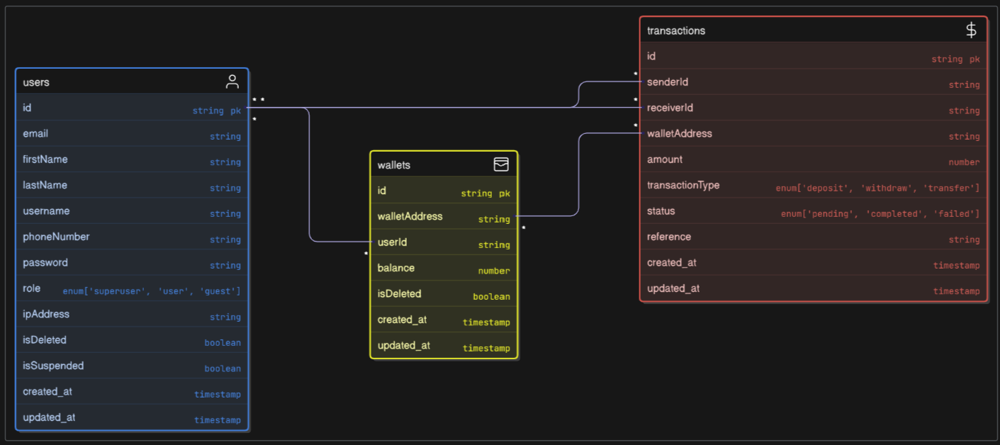

# Demo Credit 💳

Demo Credit is a wallet management application that allows users to easily register, manage their wallets, and perform various financial transactions, including funding, withdrawing, and transferring money to other users.

## Features

- **User Registration and Authentication**: Secure registration and login process.

- **Wallet Management**: Users can fund, withdraw, and transfer funds securely programmatically.

- **User-to-User Transfers**: Send money to other users within the system using wallet addresses.

### Authentication

This project uses JWT-based authentication with secure cookie storage. On successful login, the server sets the following HTTP-only cookies:

- `accessToken`: Used to authenticate protected routes. Automatically included in requests via cookies.
- `refreshToken`: Used to request new access tokens when the current one expires.

Tokens are not accessible via JavaScript (HTTP-only), enhancing protection against XSS attacks.


## Database Schema

### ER Diagram

The database structure is defined using two main tables: users and transactions.

- **Users Table**: Stores user information like email, username, password, and wallet details.

- **Transactions Table**: Tracks all transactions performed by users, including wallet transfers, deposits, and withdrawals.

Here’s a visual representation of the schema:


## Technologies Used

The Project technologies used:

- [x] Nodejs
- [x] Typescript
- [x] MySQL
- [x] Knexjs ORM


### Testing the API

Use tools like Postman or Insomnia to test the API.

### Authentication Endpoints

1. **Register a User**

- **Endpoint**: `{{BASE_URL}}/api/v1/auth/sign-up`
- **Method**: `POST`
- **Description**: Create a new account.
- **Request Body**:

```json
{
	"email": "string",
	"password": "string",
	"firstName": "string",
	"lastName": "string",
	"username": "string",
	"phoneNumber": "string"
}
```

- **Response**:

```json
{
	"status": "success",
	"data": [{
      "id": "string",
		"email": "string",
	   "password": "string",
	   "firstName": "string",
	   "lastName": "string",
	   "username": "string",
	   "phoneNumber": "string",
      "role": "string",
      "ipAddress": "string",
	   "isSuspended": "boolean",
      "created_at": "timestamp"
	}]
	"message": "User created successfully"
}
```

2. **Login**

- **Endpoint**: `{{BASE_URL}}/api/v1/auth/sign-in`
- **Method**: `POST`
- **Description**: Login to your account.
- **Request Body**:

```json
{
	"email": "string",
	"password": "string"
}
```

- **Response**:

```json
{
	"status": "success",
	"data": [{
	   "id": "string",
	   "firstName": "string",
	   "lastName": "string",
	   "username": "string",
	   "phoneNumber": "string",
	   "email": "string",
	   "role": "string",
	   "ipAddress": "string",
	   "isSuspended": "boolean",
	   "created_at": "timestamp",
	}],
	"message": "Login successful"
}
```

3. **Logout**

- **Endpoint**: `{{BASE_URL}}/api/v1/auth/sign-out`
- **Method**: `POST`
- **Description**: Log out of your account and invalidate the current session tokens.

- **Response**:

```json
{
	"status": "success",
	"data": null,
	"message": "Logout successful"
}
```

### User Endpoints

1. **Get All Users**

- **Endpoint**: `{{BASE_URL}}/api/v1/user/all`
- **Method**: `GET`
- **Description**: Fetch all users on the platform.

- **Response**:

```json
{
	"status": "success",
	"data": [{
	   "id": "string",
	   "firstName": "string",
	   "lastName": "string",
	   "username": "string",
	   "phoneNumber": "string",
	   "email": "string",
	   "role": "string",
	   "ipAddress": "string",
	   "isSuspended": "boolean",
	   "created_at": "timestamp",
	}],
	"message": "Users data retrieved successfully"
}
```

### Wallet Endpoints

1. **Fund Wallet**

- **Endpoint**: `{{BASE_URL}}/api/v1/wallet/fund`
- **Method**: `POST`
- **Description**: Add funds to your wallet by specifying the amount to deposit. This endpoint increases your wallet balance and records the transaction.
- **Request Body**:

```json
{
	"amount": "number"
}
```

- **Response**:

```json
{
	"status": "success",
	"data": [{
	   "id": "string",
	   "balance": "number",
	   "walletAddress": "string",
	   "created_at": "timestamp",
	}],
	"message": "Wallet funded successfully"
}
```

2. **Wallet to wallet transfer**

- **Endpoint**: `{{BASE_URL}}/api/v1/wallet/transfer`
- **Method**: `POST`
- **Description**: Transfer funds from your wallet to another user's wallet by specifying the recipient's wallet address and the amount to transfer. This endpoint deducts the specified amount from your wallet, credits it to the recipient, and records the transaction.
- **Request Body**:

```json
{
	"amount": "number",
   "walletAddress": "string"
}
```

- **Response**:

```json
{
	"status": "success",
	"data": [{
	   "id": "string",
	   "balance": "number",
	   "walletAddress": "string",
	   "created_at": "timestamp",
	}],
	"message": "Transfer successful"
}
```

3. **Withdraw Funds**

- **Endpoint**: `{{BASE_URL}}/api/v1/wallet/withdraw`
- **Method**: `POST`
- **Description**: Withdraw funds from your wallet by specifying the amount. This endpoint deducts the specified amount from your wallet balance and records the withdrawal transaction.
- **Request Body**:

```json
{
	"amount": "number"
}
```

- **Response**:

```json
{
	"status": "success",
	"data": [{
	   "id": "string",
	   "balance": "number",
	   "walletAddress": "string",
	   "created_at": "timestamp",
	}],
	"message": "Withdrawal successful"
}
```

### Prerequisites

Make sure you have the following installed:

- Node.js (v22 LTS recommended)
- npm
- MySQL (or access to a running MySQL instance)

## Getting Started

### Installation

To install Demo Credit locally:

1. Clone the repository:

```bash
   git clone https://github.com/Davheed2/lendSqrr.git
```

2. Change to the project directory:

```bash
   cd lendSqrr
```

3. Install dependencies

```bash
   npm install
```

4. Set up environment variables by copying `.env.example` to `.env` and filling in your credentials.

### Database Setup

1. Create your MySQL database (e.g., demo_credit_db)
2. Configure your environment variables in the .env file (you can copy from .env.example)
3. Run the development server this will automatically apply all database migrations

### Running the Project

To start the server:

```bash
   npm run dev
```

You should be able to access the API at `http://localhost:your-port`.

### Running Tests

To run tests:

```bash
npm run test
```

## License

By contributing to Demo Credit, you agree that your contributions will be licensed under the [MIT License](LICENSE.md).

---
